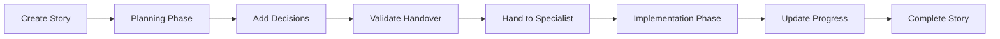

# n8n-MCP Modern 🚀

[](https://opensource.org/licenses/MIT)
[](https://github.com/eekfonky/n8n-mcp-modern)
[](https://www.typescriptlang.org/)
[](https://github.com/eekfonky/n8n-mcp-modern)
[](https://github.com/eekfonky/n8n-mcp-modern)

**Modern n8n MCP server built from the ground up with zero legacy dependencies and maximum performance.**

## 🎯 What's New

**v5.2.8** - Enterprise Security & JavaScript Excellence - [See all releases](./RELEASES.md)
- ✅ JavaScript Validator Integration for comprehensive security analysis
- ✅ Command Injection Prevention with secure spawn-based execution
- ✅ Complete Input Validation Layer for all user input
- ✅ Structured Logging System with file output and metadata

## 🚀 Quick Start

### Prerequisites

For optimal agent performance, install these companion MCP servers:

```bash
# Context7 MCP - Real-time documentation access (HIGHLY RECOMMENDED)
claude mcp add context7 -s user -- npx -y @upstash/context7-mcp

# Sequential Thinking MCP - Enhanced reasoning for complex tasks
claude mcp add sequential-thinking -s user -- npx -y @modelcontextprotocol/server-sequential-thinking
```

### Installation

**Method 1: Local Installation (Most Reliable)**

```bash
# Clone and build
git clone https://github.com/eekfonky/n8n-mcp-modern.git
cd n8n-mcp-modern
npm install
npm run build

# Add to Claude Code
claude mcp add n8n-mcp-modern \
  --env N8N_API_URL="https://your-n8n-instance.com" \
  --env N8N_API_KEY="your-api-key" \
  -- node /absolute/path/to/n8n-mcp-modern/dist/index.js
```

**Method 2: NPM Installation**

```bash
# Install globally (skip problematic scripts if needed)
npm install -g n8n-mcp-modern --ignore-scripts

# Configure and install
N8N_API_URL="https://your-n8n-instance.com" \
N8N_API_KEY="your-api-key" \
n8n-mcp install
```

> **🐳 Docker Users**: Add `N8N_API_ENDPOINT_REST=api/v1` to your n8n environment variables and restart before creating API keys.

## 🏗️ Architecture

### Ultra-Minimal Dependencies (5 packages vs 1000+ in legacy)

```json
{
  "@modelcontextprotocol/sdk": "^1.17.3",  // Official MCP SDK
  "better-sqlite3": "^12.2.0",              // SQLite database
  "undici": "^7.0.0",                       // HTTP client
  "dotenv": "^17.2.1",                      // Configuration
  "zod": "^3.25.76",                        // Validation
  ...
}
```

### Performance Metrics

- 🚀 **95% Smaller Bundle**: 1.1GB → 15MB
- ⚡ **10x Faster Install**: 3+ minutes → <30 seconds
- 🔒 **Zero Vulnerabilities**: Clean security audit
- 💨 **2x Faster Runtime**: Modern V8 optimizations

## 🤖 6-Agent Hierarchy System

```
TIER 1: MASTER ORCHESTRATOR
├─ n8n-orchestrator - Strategic planning & multi-agent coordination

TIER 2: CORE SPECIALISTS  
├─ n8n-connector - Authentication & connectivity (525+ platforms)
├─ n8n-builder - Code generation, templates, DevOps workflows
├─ n8n-node-expert - 525+ node expertise + AI/ML patterns
└─ n8n-scriptguard - JavaScript validation & security

TIER 3: SUPPORT SPECIALISTS
├─ n8n-guide - Documentation, tutorials & best practices
└─ (Additional research agents as needed)
```

## 🧠 BMAD-METHOD Agentic Handover System

**n8n-MCP Modern** implements **BMAD-METHOD inspired** agentic handover patterns for context-rich, multi-agent workflows. This eliminates **planning inconsistency** and **context loss** - the biggest problems in AI-assisted development.

### 🎯 Core Principles

- **Story Files**: Persistent context preservation across agent boundaries
- **Two-Phase Workflows**: Optional planning → implementation separation  
- **Decision Audit Trails**: Complete visibility into agent reasoning
- **Handover Validation**: Ensures context completeness before transitions
- **Performance Metrics**: Track handover efficiency and story completeness

### 📋 Story File Lifecycle



### 🚀 Usage Examples

#### Automatic Story Creation

```typescript
// Stories are automatically created during complex escalations
const request: EscalationRequest = {
  originalToolName: 'create_complex_workflow',
  reason: EscalationReason.COMPLEXITY_EXCEEDED,
  requiresNewStory: true,           // Creates story file
  completedWork: ['Analysis phase'],
  pendingWork: ['Implementation', 'Testing'],
  technicalContext: {
    filesModified: ['workflow.json'],
    testingRequired: true,
    performanceImpact: 'high'
  }
}
```

#### Manual Story Management

```typescript
// Create story file manually
const story = await communicationManager.createStoryFile(
  'n8n-workflow-architect',
  { workflowType: 'data-processing', complexity: 'high' },
  ['Initial planning complete']
)

// Add architectural decision
await storyManager.addDecision(story.id, {
  description: 'Use event-driven architecture',
  rationale: 'Better scalability for high throughput',
  impact: 'high',
  reversible: false
})

// Hand over to specialist with validation
const handedOver = await communicationManager.handoverStoryFile(
  story.id,
  'n8n-developer-specialist',
  'Architecture complete. Event-driven pattern selected. Ready for implementation.'
)
```

#### Two-Phase Workflow

```typescript
// Phase 1: Planning
let story = await storyManager.create({
  currentAgent: 'n8n-orchestrator',
  phase: WorkflowPhase.PLANNING,
  context: { requirements: [...] }
})

// Complete planning work
story = await storyManager.update(story.id, {
  completedWork: ['Requirements analysis', 'Architecture design'],
  decisions: [architecturalDecision]
})

// Phase 2: Implementation
story = await storyManager.transitionPhase(story.id, WorkflowPhase.IMPLEMENTATION)
story = await storyManager.handover(story.id, 'n8n-builder', 'Planning complete...')
```

### 📊 Story File Structure

```typescript
interface StoryFile {
  // Identity & versioning  
  id: string
  version: number
  createdAt: number
  updatedAt: number
  
  // Workflow tracking
  phase: 'planning' | 'implementation' | 'validation' | 'completed'
  status: 'draft' | 'active' | 'handed_over' | 'completed' | 'archived'
  
  // Agent information  
  currentAgent: string
  previousAgents: string[]
  
  // Context preservation
  context: {
    original: AgentContext    // Immutable initial context
    current: AgentContext     // Evolving context
    technical: TechnicalContext // Code, tests, performance data
  }
  
  // Work tracking
  completedWork: string[]
  pendingWork: string[]
  blockers?: string[]
  
  // Decision audit trail
  decisions: DecisionRecord[]
  
  // Handover validation
  handoverNotes: string
  acceptanceCriteria?: string[]
  rollbackPlan?: string
}
```

### 🔍 Decision Records

Every significant decision is tracked with full context:

```typescript
interface DecisionRecord {
  id: string
  timestamp: number
  agentName: string
  decisionType: 'technical' | 'architectural' | 'process' | 'escalation'
  description: string
  rationale: string
  alternatives?: string[]  // What else was considered
  impact: 'low' | 'medium' | 'high' | 'critical'
  reversible: boolean
  dependencies?: string[]
  outcome?: {             // Post-implementation results
    success: boolean
    notes?: string
    measuredImpact?: string
  }
}
```

### ✅ Handover Validation

Before any agent handover, the system validates context completeness:

- **Handover notes**: Minimum 10 characters with meaningful content
- **Work status**: Completed and pending work clearly defined  
- **Decision trail**: Key decisions documented with rationale
- **Technical context**: Code changes, test status, performance data
- **Security considerations**: Vulnerability assessment, rollback plans

**Completeness Score**: 0-100 based on context richness and validation criteria.

### 📈 Performance Metrics

Story file system includes comprehensive analytics:

```typescript
interface StoryMetrics {
  totalStories: number
  storiesByPhase: Record<WorkflowPhase, number>
  storiesByStatus: Record<StoryStatus, number>
  averageCompletionTime: number      // End-to-end story lifecycle
  averageDecisionsPerStory: number   // Decision documentation rate
  averageHandovers: number           // Agent collaboration frequency
  completenessScores: number[]       // Handover quality metrics
}
```

### 🛠️ Migration & Setup

#### For New Installations
Story files are automatically enabled - no additional setup required.

#### For Existing Installations
Run the migration script to add story file support:

```bash
# Check what will be migrated (dry run)
node scripts/migrate-story-files.cjs --dry-run

# Create backup and migrate
node scripts/migrate-story-files.cjs --backup

# Force migration (skip confirmations)
node scripts/migrate-story-files.cjs --force --backup
```

#### Environment Variables

```bash
# Story file configuration (optional)
STORY_FILE_TTL=604800000          # 7 days default cleanup
STORY_CACHE_SIZE=300              # LRU cache size
STORY_HANDOVER_VALIDATION=true    # Enable validation
```

### 🧪 Testing

Comprehensive test coverage ensures reliability:

```bash
# Run story file tests
npm test src/tests/story-files.test.ts

# Run integration tests  
npm test src/tests/agent-handover-integration.test.ts

# Coverage report
npm run test:coverage
```

### 🎯 Benefits

- **Zero Context Loss**: Complete preservation across agent boundaries
- **Decision Transparency**: Full audit trail of agent reasoning  
- **Quality Gates**: Validation ensures handover completeness
- **Performance Visibility**: Metrics for continuous improvement
- **Backward Compatible**: Works seamlessly with existing workflows

## 🛠️ 92 MCP Tools

### Tool Categories

- **🔧 Code Generation** (12 tools) - Workflow creation from natural language
- **🛠️ DevOps Integration** (10 tools) - CI/CD, Git, deployment automation
- **📊 Performance & Monitoring** (12 tools) - Analytics, optimization, alerting
- **📚 Core n8n Management** (46 tools) - Workflows, credentials, nodes, users
- **🔍 Additional Utilities** (12 tools) - Search, validation, debugging

**Total: 92 tools** providing comprehensive n8n workflow automation capabilities.

### Key Capabilities

- Generate workflows from descriptions
- Create API integrations and webhooks
- Build data processing pipelines
- Setup CI/CD automation
- Monitor performance metrics
- Manage credentials securely
- Validate and optimize workflows

## 🚀 Usage Examples

### Basic MCP Tool Usage

```bash
# Search for n8n nodes
claude mcp call n8n-mcp-modern search_n8n_nodes '{"query": "HTTP Request"}'

# Get workflow list  
claude mcp call n8n-mcp-modern get_n8n_workflows '{"limit": 10}'

# Create a simple workflow
claude mcp call n8n-mcp-modern create_n8n_workflow '{
  "name": "Test Workflow", 
  "nodes": [{"type": "webhook", "name": "Webhook"}],
  "settings": {}
}'
```

### Agent Integration

```bash
# Use Task tool to delegate to specialists
"Task: Create a webhook that processes customer data and sends to Slack"
# → Routes to n8n-builder for code generation

"Task: Set up OAuth with Google Sheets" 
# → Routes to n8n-connector for authentication

"Task: What's the best node for CSV processing?"
# → Routes to n8n-node-expert for guidance
```

## 🔧 Configuration

### Environment Variables

```bash
# Core Settings
MCP_MODE=stdio                           # Optimized for Claude Code
LOG_LEVEL=info                          # Logging level
N8N_API_URL=https://your-n8n-instance.com
N8N_API_KEY=your-api-key

# Performance (optional)
ENABLE_CACHE=true
CACHE_TTL=3600
MAX_CONCURRENT_REQUESTS=10
```

### Getting n8n API Credentials

1. **n8n Cloud**: Settings → API → Generate key
2. **Self-hosted**: Enable API in settings → Generate key
3. **Docker**: Ensure `N8N_API_ENDPOINT_REST=api/v1` is set

## 📦 Migration from Legacy

From `@lexinet/n8n-mcp-modern` or legacy versions:

```bash
# Quick migration
curl -fsSL https://raw.githubusercontent.com/eekfonky/n8n-mcp-modern/main/migration-standalone.sh | bash

# Or manual steps
claude mcp remove n8n-mcp-modern
npm cache clean --force
npx @eekfonky/n8n-mcp-modern install
```

## 🧪 Development

```bash
# Setup
git clone https://github.com/eekfonky/n8n-mcp-modern.git
cd n8n-mcp-modern
npm install

# Development
npm run dev           # Watch mode
npm run build         # Production build
npm test              # Run tests
npm run lint          # Linting
npm run typecheck     # Type checking
npm run rebuild-db    # Rebuild node database
```

## 🐳 Docker Deployment

### Production Setup with SSL

See [Docker Configuration Guide](./docs/docker-setup.md) for complete production setup with Traefik and SSL.

### Minimal Development Setup

```yaml
services:
  n8n:
    image: docker.n8n.io/n8nio/n8n
    ports:
      - "5678:5678"
    environment:
      - N8N_API_ENDPOINT_REST=api/v1
      - N8N_PUBLIC_API_ENABLED=true
      - N8N_COMMUNITY_PACKAGES_ENABLED=true
    volumes:
      - n8n_data:/home/node/.n8n
```

## 🔧 Troubleshooting

### Common Issues

**Installation hangs**: Use `--ignore-scripts` flag
```bash
npm install -g n8n-mcp-modern --ignore-scripts
```

**API Connection Issues**: Validate configuration
```bash
validate_mcp_config
validate_mcp_config {"fix_issues": true}
```

**Node.js Version**: Requires Node.js 22+
```bash
node --version  # Should be v22.0.0 or higher
```

## 📚 Documentation

- [Release History](./RELEASES.md) - All version updates
- [Agent Documentation](./agents/README.md) - Agent capabilities
- [API Reference](./docs/api.md) - Tool documentation
- [Docker Setup](./docs/docker-setup.md) - Complete Docker guide

## 🤝 Contributing

We welcome contributions! Please ensure:
- TypeScript strict mode compliance
- ESM-only patterns
- Zod validation for inputs
- Comprehensive test coverage
- Zero security vulnerabilities

## 📄 License

MIT License - see [LICENSE](./LICENSE) file for details.

## 🏆 Credits

Modern TypeScript rebuild by [eekfonky](https://github.com/eekfonky).

---

_Built for Claude Code users who demand modern, secure, high-performance n8n automation._ 🎯