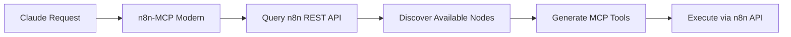

# n8n-MCP Modern API Documentation

## Overview

n8n-MCP Modern provides **dynamic MCP tools** that adapt to your n8n instance's capabilities. Instead of maintaining static tool lists, the system discovers your n8n's available nodes and generates corresponding MCP tools in real-time.

## How It Works

### 1. Real-Time Discovery


### 2. Dynamic Tool Generation

When you connect to an n8n instance, the system:

1. **Discovers Node Types:** Queries `/api/v1/node-types` for available nodes
2. **Generates MCP Tools:** Creates one tool per node type automatically
3. **Validates Parameters:** Uses n8n's native schemas for validation
4. **Executes Workflows:** Creates and runs workflows via n8n's REST API

## Core MCP Tools

### Workflow Management

#### `n8n_list_workflows`
List workflows from your n8n instance.
- **Maps to:** `GET /api/v1/workflows`
- **Parameters:** `active`, `tags`, `name` (all optional)

#### `n8n_create_workflow`
Create a new workflow.
- **Maps to:** `POST /api/v1/workflows`
- **Parameters:** `name`, `nodes`, `connections`, `active`, `settings`

#### `n8n_get_workflow`
Get detailed workflow information.
- **Maps to:** `GET /api/v1/workflows/{id}`
- **Parameters:** `id` (workflow ID)

#### `n8n_execute_workflow`
Execute a workflow with optional input data.
- **Maps to:** `POST /api/v1/workflows/{id}/execute`
- **Parameters:** `id`, `data`

### Node Discovery

#### `n8n_discover_nodes`
Discover available node types in your n8n instance.
- **Maps to:** `GET /api/v1/node-types`
- **Returns:** Complete list of available nodes with schemas

#### `n8n_get_node_schema`
Get detailed schema for a specific node type.
- **Parameters:** `nodeType` (e.g., "n8n-nodes-base.slack")
- **Returns:** Full node schema including parameters and credentials

## Dynamic Node Tools

For each node type discovered in your n8n instance, a corresponding MCP tool is generated:

### Example: Slack Integration
If your n8n has the Slack node installed:

```typescript
// Generated tool: n8n_slack
{
  name: "n8n_slack",
  description: "Send messages and interact with Slack",
  inputSchema: {
    // Generated from Slack node's parameter schema
    type: "object",
    properties: {
      resource: { enum: ["message", "channel", "user"] },
      operation: { enum: ["send", "get", "list"] },
      channel: { type: "string" },
      text: { type: "string" }
      // ... other parameters from n8n's Slack node
    }
  }
}
```

### Example: GitHub Integration
If your n8n has the GitHub node:

```typescript
// Generated tool: n8n_github
{
  name: "n8n_github",
  description: "Interact with GitHub repositories and issues",
  inputSchema: {
    // Generated from GitHub node's parameter schema
    type: "object",
    properties: {
      resource: { enum: ["issue", "repository", "user"] },
      operation: { enum: ["get", "create", "update", "list"] },
      owner: { type: "string" },
      repository: { type: "string" }
      // ... other parameters from n8n's GitHub node
    }
  }
}
```

## Authentication

### Environment Variables
```bash
# Required for full functionality
N8N_API_URL=https://your-n8n-instance.com
N8N_API_KEY=your-api-key

# Optional configurations
MCP_MODE=stdio
LOG_LEVEL=info
ENABLE_CACHE=true
```

### Connection Modes

#### 1. **With n8n API Connection (Recommended)**
- Full workflow creation and execution
- Real-time node discovery
- Credential management
- Workflow monitoring

#### 2. **Standalone Mode**
- Limited to basic n8n knowledge
- No real-time discovery
- Cannot execute workflows
- Useful for learning and planning

## Error Handling

All tools return standardized responses:

### Success Response
```json
{
  "success": true,
  "data": {
    // Tool-specific response data
  },
  "metadata": {
    "executionTime": 234,
    "nodeCount": 3,
    "apiCalls": 2
  }
}
```

### Error Response
```json
{
  "success": false,
  "error": {
    "message": "Workflow validation failed",
    "code": "VALIDATION_ERROR",
    "details": {
      "nodeId": "slack-node",
      "parameter": "channel",
      "issue": "Required parameter missing"
    }
  }
}
```

## Conversation Examples

### Natural Language Workflow Creation

**User:** "Create a workflow that sends a Slack message when a new GitHub issue is opened"

**Process:**
1. System discovers available GitHub and Slack nodes
2. Generates workflow structure with proper connections
3. Validates all node parameters
4. Creates workflow via n8n API
5. Returns workflow ID and activation status

**Generated Workflow:**
```json
{
  "name": "GitHub Issues to Slack",
  "nodes": [
    {
      "id": "github-trigger",
      "type": "n8n-nodes-base.githubTrigger",
      "parameters": {
        "events": ["issues.opened"]
      }
    },
    {
      "id": "slack-message",
      "type": "n8n-nodes-base.slack",
      "parameters": {
        "channel": "#alerts",
        "text": "New issue: {{$node.github-trigger.json.title}}"
      }
    }
  ],
  "connections": {
    "github-trigger": {
      "main": [["slack-message"]]
    }
  }
}
```

## Advanced Features

### Batch Operations
```typescript
// Process multiple workflows
n8n_batch_create_workflows({
  workflows: [workflow1, workflow2, workflow3],
  activateAll: true
})
```

### Template Generation
```typescript
// Generate workflow from description
n8n_generate_workflow({
  description: "Monitor RSS feeds and post to Discord",
  includeErrorHandling: true,
  complexity: "standard"
})
```

### Performance Monitoring
```typescript
// Analyze workflow performance
n8n_analyze_performance({
  workflowId: "abc123",
  timeRange: "last_7_days",
  includeOptimizations: true
})
```

## Rate Limiting

- **Default:** 10 concurrent requests to n8n API
- **Configurable:** Set `MAX_CONCURRENT_REQUESTS` environment variable
- **Auto-backoff:** Automatically handles rate limit responses
- **Queue management:** Requests queued during high load

## Getting Started

1. **Install and Connect:**
   ```bash
   claude mcp add n8n-mcp-modern \
     --env N8N_API_URL=https://your-n8n.com \
     --env N8N_API_KEY=your-key \
     -- npx -y @eekfonky/n8n-mcp-modern
   ```

2. **Verify Connection:**
   ```text
   User: "What nodes are available in my n8n instance?"
   ```

3. **Start Building:**
   ```text
   User: "Create a simple data processing workflow"
   ```

The system will guide you through the process, discovering your n8n capabilities and building workflows through natural conversation.

## Troubleshooting

### Common Issues

**No nodes discovered:**
- Check n8n API URL and key
- Verify n8n instance is accessible
- Ensure API key has proper permissions

**Workflow creation fails:**
- Verify node parameters match your n8n version
- Check credential configurations
- Review n8n logs for validation errors

**Performance issues:**
- Reduce concurrent requests
- Enable caching with `ENABLE_CACHE=true`
- Check n8n instance resources

For more help, see [Troubleshooting Guide](troubleshooting.md).