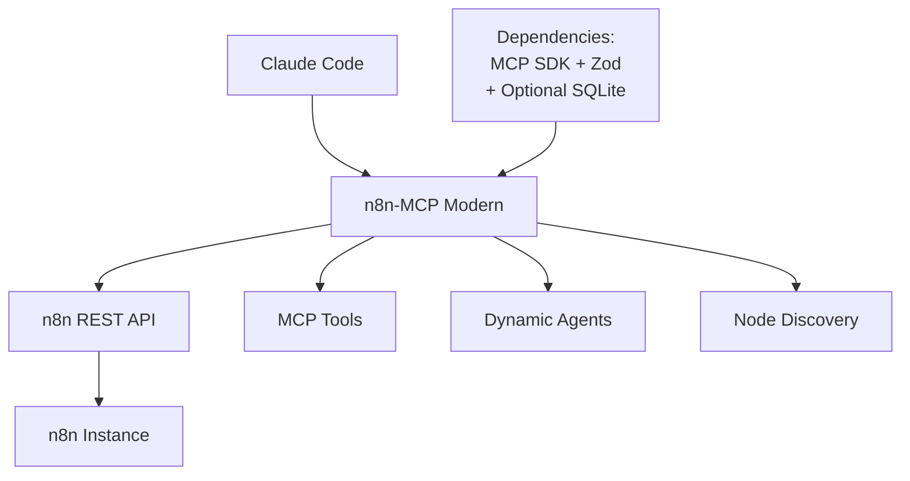

# n8n-MCP Modern Deployment Guide

## Overview

This guide covers deploying n8n-MCP Modern with its ultra-minimal dependency architecture (2-3 packages only) for production environments.

## Architecture Summary



## Deployment Options

### Option 1: NPX (Zero Installation)

**Best for:** Quick testing, temporary use, CI/CD environments

```bash
# Direct execution with NPX
npx -y @eekfonky/n8n-mcp-modern

# With environment variables
N8N_API_URL=https://your-n8n.com N8N_API_KEY=your-key npx -y @eekfonky/n8n-mcp-modern

# In Claude Code MCP config
{
  "mcpServers": {
    "n8n-mcp-modern": {
      "command": "npx",
      "args": ["-y", "@eekfonky/n8n-mcp-modern"],
      "env": {
        "N8N_API_URL": "https://your-n8n-instance.com",
        "N8N_API_KEY": "your-api-key"
      }
    }
  }
}
```

### Option 2: Global Installation

**Best for:** Development environments, local usage

```bash
# Install globally
npm install -g @eekfonky/n8n-mcp-modern

# Run directly
n8n-mcp

# With environment variables
N8N_API_URL=https://your-n8n.com N8N_API_KEY=your-key n8n-mcp
```

### Option 3: Container Deployment

**Best for:** Production environments, orchestrated deployments

```dockerfile
FROM node:22-alpine

# Ultra-minimal image - only essential dependencies
RUN npm install -g @eekfonky/n8n-mcp-modern

# Runtime user for security
RUN adduser -D -s /bin/sh n8nuser
USER n8nuser

# Expose MCP port
EXPOSE 3000

# Environment configuration
ENV NODE_ENV=production
ENV MCP_MODE=stdio
ENV LOG_LEVEL=info

CMD ["n8n-mcp"]
```

### Option 4: Serverless Deployment

**Best for:** Auto-scaling, pay-per-use, cloud-native environments

```yaml
# serverless.yml
service: n8n-mcp-modern

provider:
  name: aws
  runtime: nodejs22.x
  region: us-east-1
  environment:
    N8N_API_URL: ${env:N8N_API_URL}
    N8N_API_KEY: ${env:N8N_API_KEY}

functions:
  mcp:
    handler: dist/lambda.handler
    timeout: 30
    memorySize: 256
    events:
      - http:
          path: /mcp
          method: any
```

## Production Configuration

### Environment Variables

```bash
# Core Configuration
N8N_API_URL=https://your-n8n-instance.com      # Required for full functionality
N8N_API_KEY=your-api-key                       # Required for full functionality
MCP_MODE=stdio                                 # MCP protocol mode
LOG_LEVEL=info                                 # Logging verbosity

# Performance Tuning
ENABLE_CACHE=true                              # Enable response caching
CACHE_TTL=3600                                 # Cache TTL in seconds
MAX_CONCURRENT_REQUESTS=10                     # Concurrent n8n API requests
REQUEST_TIMEOUT=30000                          # Request timeout in ms

# Security
DISABLE_CONSOLE_OUTPUT=false                   # Disable debug output in prod
RATE_LIMIT_DELAY=100                          # Rate limiting delay in ms

# Optional Features
ENABLE_METRICS=true                            # Enable performance metrics
METRICS_PORT=9090                             # Metrics endpoint port
HEALTH_CHECK_INTERVAL=30000                   # Health check interval in ms
```

### Production Checklist

- [ ] **Node.js Version**: Ensure Node.js 22+ for modern `fetch()` API
- [ ] **Memory Limits**: Allocate minimum 128MB, recommended 256MB
- [ ] **Network Access**: Ensure connectivity to n8n instance
- [ ] **API Credentials**: Validate n8n API key has required permissions
- [ ] **Logging**: Configure appropriate log level for environment
- [ ] **Monitoring**: Set up health checks and metrics collection
- [ ] **Security**: Use environment variables for sensitive data

## High Availability Setup

### Load Balancing

```yaml
# docker-compose.yml
version: '3.8'

services:
  n8n-mcp-1:
    image: n8n-mcp-modern:latest
    environment:
      - N8N_API_URL=${N8N_API_URL}
      - N8N_API_KEY=${N8N_API_KEY}
      - LOG_LEVEL=info
    deploy:
      replicas: 3
      resources:
        limits:
          memory: 256M
        reservations:
          memory: 128M

  nginx:
    image: nginx:alpine
    ports:
      - "80:80"
    volumes:
      - ./nginx.conf:/etc/nginx/nginx.conf
    depends_on:
      - n8n-mcp-1
```

### Health Monitoring

```bash
#!/bin/bash
# health-check.sh

curl -f http://localhost:3000/health || exit 1
```

```javascript
// Built-in health endpoint
// GET /health
{
  "status": "healthy",
  "uptime": 3600,
  "memoryUsage": {
    "rss": 52428800,
    "heapTotal": 29360128,
    "heapUsed": 17825480
  },
  "n8nConnection": "connected",
  "discoveredNodes": 245,
  "lastDiscovery": "2024-01-15T10:30:00.000Z"
}
```

## Performance Optimization

### Memory Management

```typescript
// Automatic garbage collection tuning
process.env.NODE_OPTIONS = [
  '--max-old-space-size=256',  // Limit heap to 256MB
  '--gc-interval=100',         // More frequent GC
  '--optimize-for-size'        // Optimize for memory efficiency
].join(' ');
```

### Caching Strategy

```typescript
// Built-in caching configuration
const cacheConfig = {
  nodeTypes: {
    ttl: 3600,      // Cache node types for 1 hour
    maxEntries: 1000
  },
  workflows: {
    ttl: 300,       // Cache workflows for 5 minutes
    maxEntries: 100
  },
  executions: {
    ttl: 60,        // Cache executions for 1 minute
    maxEntries: 50
  }
};
```

### Connection Pooling

```typescript
// Automatic connection management
const httpConfig = {
  keepAlive: true,
  maxSockets: 10,
  maxFreeSockets: 5,
  timeout: 30000,
  keepAliveTimeout: 30000
};
```

## Security Considerations

### API Key Management

```bash
# Use secrets management in production
kubectl create secret generic n8n-mcp-secrets \
  --from-literal=N8N_API_KEY=your-api-key \
  --from-literal=N8N_API_URL=https://your-n8n.com
```

### Network Security

```yaml
# Kubernetes NetworkPolicy
apiVersion: networking.k8s.io/v1
kind: NetworkPolicy
metadata:
  name: n8n-mcp-policy
spec:
  podSelector:
    matchLabels:
      app: n8n-mcp-modern
  policyTypes:
  - Egress
  egress:
  - to:
    - namespaceSelector:
        matchLabels:
          name: n8n-namespace
    ports:
    - protocol: TCP
      port: 5678  # n8n API port
```

### Input Validation

All inputs are validated using Zod schemas:

```typescript
// Built-in security features
- Request sanitization
- Parameter validation
- Rate limiting
- Error message filtering
- Credential masking in logs
```

## Monitoring & Observability

### Metrics Collection

```typescript
// Built-in metrics (if ENABLE_METRICS=true)
// Available at /metrics endpoint

n8n_mcp_requests_total{method="GET",endpoint="/workflows"}
n8n_mcp_request_duration_seconds{method="POST",endpoint="/workflows"}
n8n_mcp_n8n_api_calls_total{endpoint="node-types"}
n8n_mcp_cache_hits_total{type="nodeTypes"}
n8n_mcp_active_connections_count
```

### Logging

```json
{
  "timestamp": "2024-01-15T10:30:00.000Z",
  "level": "info",
  "message": "Node discovery completed",
  "metadata": {
    "nodeCount": 245,
    "duration": 1234,
    "cacheHit": false
  }
}
```

## Troubleshooting

### Common Issues

**Memory Issues:**
```bash
# Check memory usage
curl http://localhost:3000/health | jq '.memoryUsage'

# Adjust memory limits
export NODE_OPTIONS="--max-old-space-size=512"
```

**Connection Issues:**
```bash
# Test n8n connectivity
curl -H "X-N8N-API-KEY: your-key" https://your-n8n.com/api/v1/workflows

# Check network policies
kubectl get networkpolicies
```

**Performance Issues:**
```bash
# Enable detailed logging
export LOG_LEVEL=debug

# Check cache effectiveness
curl http://localhost:3000/metrics | grep cache_hits
```

### Debug Mode

```bash
# Enable comprehensive debugging
export LOG_LEVEL=debug
export ENABLE_METRICS=true
export ENABLE_CONSOLE_OUTPUT=true

n8n-mcp
```

## Scaling Guidelines

### Horizontal Scaling

- **CPU**: 0.1-0.5 cores per instance
- **Memory**: 128-256MB per instance
- **Replicas**: 3-5 instances for HA
- **Load balancing**: Round-robin or least-connections

### Vertical Scaling

- **Small deployment**: 128MB RAM, 0.1 CPU
- **Medium deployment**: 256MB RAM, 0.25 CPU
- **Large deployment**: 512MB RAM, 0.5 CPU

### Auto-scaling Configuration

```yaml
# Kubernetes HPA
apiVersion: autoscaling/v2
kind: HorizontalPodAutoscaler
metadata:
  name: n8n-mcp-hpa
spec:
  scaleTargetRef:
    apiVersion: apps/v1
    kind: Deployment
    name: n8n-mcp-modern
  minReplicas: 2
  maxReplicas: 10
  metrics:
  - type: Resource
    resource:
      name: cpu
      target:
        type: Utilization
        averageUtilization: 70
  - type: Resource
    resource:
      name: memory
      target:
        type: Utilization
        averageUtilization: 80
```

## Backup & Recovery

### State Management

n8n-MCP Modern is stateless by design:
- No persistent data storage required
- Configuration via environment variables
- Node discovery happens at runtime
- Workflows stored in n8n instance

### Disaster Recovery

```bash
# Backup configuration
kubectl get configmap n8n-mcp-config -o yaml > n8n-mcp-backup.yaml

# Restore from backup
kubectl apply -f n8n-mcp-backup.yaml

# Verify deployment
kubectl rollout status deployment/n8n-mcp-modern
```

## Migration Guide

### From Legacy n8n MCP Servers

1. **Backup existing configuration**
2. **Update MCP server definition**
3. **Test with new minimal setup**
4. **Migrate environment variables**
5. **Remove old dependencies**

```bash
# Old configuration (remove)
{
  "dependencies": {
    "express": "^4.18.0",
    "axios": "^1.6.0",
    // ... 1000+ other packages
  }
}

# New configuration (minimal)
{
  "dependencies": {
    "@modelcontextprotocol/sdk": "latest",
    "zod": "latest"
  }
}
```

This deployment guide ensures you can run n8n-MCP Modern reliably in any environment while maintaining the ultra-minimal dependency philosophy that makes it fast, secure, and maintainable.