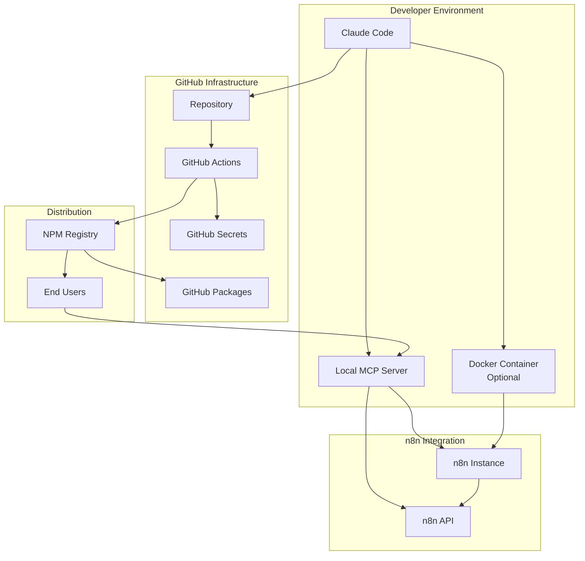
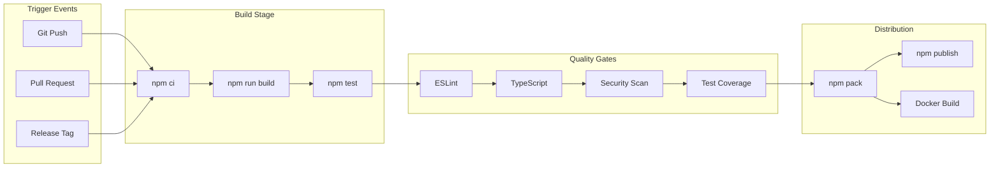

# n8n-MCP-Modern Infrastructure Architecture

_Document Version: 1.0_  
_Last Updated: 2025-08-17_  
_Next Review: 2025-09-17_

## Infrastructure Overview

**Project Context:** n8n-MCP-Modern is a high-performance MCP server providing 87+ tools for n8n workflow automation, built with zero legacy dependencies and modern TypeScript architecture.

**Deployment Strategy:**
- **Primary Environment:** Local development and execution
- **Distribution:** GitHub repository with NPM package distribution
- **CI/CD:** GitHub Actions for automated testing, building, and publishing
- **Target Users:** Claude Code and n8n workflow developers

**Core Infrastructure Principles:**
- **Minimal Overhead:** Aligned with project's zero-dependency philosophy
- **Container-First:** Ensuring portability and consistency across environments
- **Security by Design:** Implementing security controls from development to distribution
- **Developer Experience:** Optimized for ease of use and quick adoption

## Infrastructure as Code (IaC)

**Tools & Frameworks:**
- **Containerization:** Docker with multi-stage builds for optimal image size
- **CI/CD:** GitHub Actions workflows with matrix testing across Node.js versions
- **Package Management:** NPM with automated semantic versioning
- **Dependency Scanning:** GitHub Dependabot and security advisories

**Repository Structure:**
```
n8n-mcp-modern/
├── .github/
│   ├── workflows/           # CI/CD pipeline definitions
│   ├── dependabot.yml      # Automated dependency updates
│   └── security.md         # Security policy and reporting
├── .docker/
│   ├── Dockerfile          # Production container image
│   ├── Dockerfile.dev      # Development container image
│   └── docker-compose.yml  # Local development stack
├── docs/
│   ├── infrastructure-architecture.md
│   └── deployment-guide.md
└── scripts/
    ├── setup-dev.sh       # Development environment setup
    └── security-scan.sh   # Local security scanning
```

**State Management:**
- **Configuration:** Environment variables with Zod validation
- **Secrets:** GitHub Secrets for CI/CD, local .env files for development
- **Database:** SQLite with automated migrations and backup procedures

## Environment Configuration

### Development Environment
- **Purpose:** Local development and testing with Claude Code
- **Resources:** Local Node.js 22+, Docker Desktop (optional)
- **Access Control:** Local file system permissions
- **Data Classification:** Non-sensitive test data only

### Testing Environment (GitHub Actions)
- **Purpose:** Automated testing across Node.js versions (22, 23)
- **Resources:** GitHub Actions runners (ubuntu-latest, windows-latest, macos-latest)
- **Access Control:** GitHub repository permissions
- **Data Classification:** Synthetic test data only

### Distribution Environment (NPM)
- **Purpose:** Package distribution for end users
- **Resources:** NPM registry with automated publishing
- **Access Control:** NPM publish tokens stored in GitHub Secrets
- **Data Classification:** Public package distribution

## Environment Transition Strategy

**Development to Distribution Pipeline:**
1. **Local Development:** Feature development with immediate feedback
2. **Git Push:** Trigger automated testing and security scanning
3. **Pull Request:** Code review and integration testing
4. **Merge to Main:** Automated build, test, and version bumping
5. **NPM Publish:** Automated package publishing with semantic versioning

**Deployment Stages and Gates:**
- **Code Quality Gate:** ESLint, TypeScript compilation, test coverage
- **Security Gate:** Dependency scanning, SAST analysis, license validation
- **Compatibility Gate:** Multi-platform testing (Linux, Windows, macOS)
- **Integration Gate:** End-to-end MCP protocol testing

**Rollback Procedures:**
- **NPM Package:** Version rollback via `npm deprecate` and new patch release
- **Git Repository:** Standard git revert and hotfix procedures
- **Local Installation:** `npm install @lexinet/n8n-mcp-modern@previous-version`

## Network Architecture



**Security Zones:**
- **Development Zone:** Local file system with standard OS permissions
- **CI/CD Zone:** GitHub Actions with encrypted secrets and ephemeral runners
- **Distribution Zone:** NPM registry with public package access
- **Integration Zone:** n8n API with user-managed authentication

## Compute Resources

**Container Strategy:**
- **Base Image:** `node:22-alpine` for minimal attack surface
- **Multi-stage Build:** Separate build and runtime stages for optimal size
- **Security:** Non-root user, minimal dependencies, distroless runtime option
- **Resource Limits:** Memory limits for local development containers

**Local Execution:**
- **Direct Node.js:** Primary execution mode via `npm start` or global binary
- **Docker Compose:** Optional containerized development with n8n integration
- **Resource Requirements:** Minimal - 256MB RAM, 100MB disk space

**Auto-scaling Approach:**
- **Not Applicable:** Single-instance MCP server design
- **Resource Monitoring:** Built-in memory and performance monitoring via MCP metrics

## Data Resources

**Database Deployment Strategy:**
- **SQLite Database:** Embedded database for n8n node metadata and tool information
- **Location:** `data/` directory with automated initialization
- **Schema Management:** TypeScript-based migrations with rollback support
- **Performance:** Optimized indexes for tool discovery and agent routing

**Backup & Recovery:**
- **Local Backup:** Automated daily backup via `npm run backup-db`
- **Version Control:** Database schema versioned, data excluded via `.gitignore`
- **Recovery:** Database rebuild via `npm run rebuild-db` command

**Data Migration Strategy:**
- **Schema Migrations:** Automated via startup checks and migration scripts
- **Data Integrity:** Validation scripts to ensure data consistency
- **Upgrade Path:** Backward-compatible migrations with rollback procedures

## Security Architecture

**IAM & Authentication:**
- **Local Access:** File system permissions and process isolation
- **CI/CD Access:** GitHub repository permissions and encrypted secrets
- **n8n Integration:** User-managed API keys with secure storage recommendations
- **Package Access:** NPM 2FA requirement for publishing

**Network Security:**
- **Local Communication:** Localhost-only binding by default
- **TLS Encryption:** HTTPS enforcement for all external API calls (n8n API, npm registry)
- **Input Validation:** Zod-based validation for all tool inputs and configurations
- **Rate Limiting:** Built-in rate limiting for API calls to prevent abuse

**Data Encryption:**
- **At Rest:** OS-level file system encryption (user responsibility)
- **In Transit:** TLS 1.3 for all external communications
- **Secrets:** Environment variable-based secrets with secure defaults
- **Database:** SQLite encryption option available via configuration

**Compliance Controls:**
- **License Compliance:** MIT license with clear usage terms
- **Dependency Security:** Automated security scanning via GitHub Dependabot
- **Security Reporting:** Clear security policy with responsible disclosure
- **Privacy:** No telemetry collection, local-only operation by default

**Security Scanning & Monitoring:**
- **SAST:** GitHub CodeQL analysis on every pull request
- **Dependency Scanning:** Automated vulnerability detection and patching
- **Container Scanning:** Docker image security analysis in CI/CD
- **Runtime Monitoring:** Optional security event logging for production use

## Shared Responsibility Model

| Component | Developer | GitHub | NPM Registry | End User |
|-----------|-----------|---------|--------------|----------|
| Source Code Security | ✓ | - | - | Review |
| CI/CD Pipeline | Configure | ✓ | - | - |
| Package Distribution | Configure | - | ✓ | Verify |
| Local Security | Guide | - | - | ✓ |
| API Key Management | Guide | Store CI Keys | - | ✓ |
| Runtime Security | Guide | - | - | ✓ |
| Updates & Patching | Provide | Automate | Distribute | ✓ |

## Monitoring & Observability

**Metrics Collection:**
- **Application Metrics:** Built-in MCP performance metrics and tool usage statistics
- **System Metrics:** Optional system resource monitoring for performance tuning
- **Error Tracking:** Structured error logging with correlation IDs
- **Usage Analytics:** Optional anonymous usage metrics with user consent

**Logging Strategy:**
- **Application Logs:** Structured JSON logging with configurable levels
- **Audit Logs:** Security events and API access logging
- **Debug Logs:** Detailed debugging information for development
- **Log Rotation:** Automated log rotation and retention policies

**Alerting & Incident Response:**
- **Critical Errors:** Immediate logging with clear error codes and resolution guidance
- **Performance Degradation:** Warning logs for resource constraints
- **Security Events:** High-priority logging for security-related events
- **Incident Response:** Clear troubleshooting guides and support channels

## CI/CD Pipeline

**Pipeline Architecture:**


**Build Process:**
- **Dependency Installation:** `npm ci` for reproducible builds
- **TypeScript Compilation:** Strict type checking with `tsc`
- **Testing:** Vitest with coverage reporting and matrix testing
- **Linting:** ESLint with TypeScript-specific rules
- **Security Scanning:** npm audit and GitHub security advisories

**Deployment Strategy:**
- **Semantic Versioning:** Automated version bumping based on conventional commits
- **Package Publishing:** Automated NPM publishing on version tags
- **Container Building:** Multi-platform Docker images for development use
- **Documentation:** Automated README and documentation updates

**Rollback Procedures:**
- **Failed Build:** Automatic CI/CD failure with detailed error reporting
- **Failed Tests:** Build termination with test failure details
- **Security Issues:** Immediate build halt with security alert
- **Rollback Strategy:** Git revert + hotfix release process

## Disaster Recovery

**Backup Strategy:**
- **Source Code:** Git repository with multiple remotes (GitHub primary)
- **Database Schema:** Version controlled with migration scripts
- **Documentation:** Markdown files in version control
- **CI/CD Configuration:** GitHub Actions workflows in version control

**Recovery Procedures:**
- **Repository Loss:** Clone from GitHub with full history
- **Database Corruption:** Rebuild from schema and migration scripts
- **Build Environment:** Reproducible builds via package-lock.json and Dockerfile
- **Key Compromise:** Immediate secret rotation and security advisory

**RTO & RPO Targets:**
- **Recovery Time Objective (RTO):** 1 hour for critical issues
- **Recovery Point Objective (RPO):** Near-zero (version control-based)
- **Business Continuity:** Previous versions remain available on NPM

## Cost Optimization

**Resource Sizing Strategy:**
- **GitHub Actions:** Free tier usage optimization with efficient workflows
- **NPM Publishing:** Free public package hosting
- **Development Resources:** Minimal local resource requirements
- **Container Resources:** Optimized image sizes and resource limits

**Cost Monitoring & Reporting:**
- **GitHub Actions Usage:** Monthly usage tracking and optimization
- **Storage Costs:** Minimal git repository and package sizes
- **Bandwidth Costs:** CDN usage via NPM registry
- **Hidden Costs:** Time investment in security and maintenance

## BMad Integration Architecture

### Development Agent Support
- **Container Platform:** Docker Compose setup for local n8n development environments
- **GitOps Workflows:** GitHub Actions supporting application deployment patterns
- **Service Integration:** Direct MCP protocol integration for development testing
- **Developer Self-Service:** Simple npm install and configuration for immediate usage

### Product & Architecture Alignment
- **Scalability Implementation:** Horizontal scaling via multiple MCP server instances
- **Deployment Automation:** Automated NPM publishing supporting rapid iteration
- **Service Reliability:** Built-in error handling and retry mechanisms
- **Architecture Patterns:** Clean separation of concerns with agent hierarchy

### Cross-Agent Integration Points
- **CI/CD Pipeline Support:** GitHub Actions templates for frontend/backend projects
- **Monitoring Integration:** MCP metrics accessible to DevOps and QA workflows
- **Performance Requirements:** Optimized for Claude Code's performance expectations
- **Data Integration:** Structured tool metadata supporting Analyst research needs

## DevOps/Platform Feasibility Review

### Feasibility Assessment Results

**Green Light Items:**
- ✅ **Simple Deployment Model:** npm install + configuration is operationally simple
- ✅ **Minimal Dependencies:** 5 core dependencies reduces operational complexity
- ✅ **GitHub Integration:** Excellent operational tooling and automation capabilities
- ✅ **Container Strategy:** Docker provides good isolation and portability
- ✅ **Security Model:** Straightforward security boundaries and controls

**Yellow Light Items:**
- ⚠️ **Secrets Management:** Needs clear guidance for production API key management
- ⚠️ **Multi-Environment Testing:** Local-only testing may miss deployment edge cases
- ⚠️ **Monitoring Gaps:** Limited production observability without additional tooling
- ⚠️ **Backup Strategy:** SQLite backup procedures need automation

**Red Light Items:**
- 🚨 **No Red Light Items Identified** - Architecture is implementable with current constraints

**Mitigation Strategies:**
- **Secrets Management:** Document secure environment variable practices and key rotation
- **Testing Coverage:** Add integration testing with containerized n8n instances
- **Monitoring Enhancement:** Provide optional observability integration guides
- **Backup Automation:** Add automated backup scripts and recovery procedures

## Implementation Handoff

### Architecture Decision Records (ADRs)

**ADR-001: Local-First Deployment Strategy**
- **Decision:** Primary deployment target is local development environments
- **Rationale:** Aligns with MCP protocol design and Claude Code integration patterns
- **Consequences:** Simplified operations but requires clear installation documentation

**ADR-002: GitHub Actions for CI/CD**
- **Decision:** Use GitHub Actions for all automation and publishing
- **Rationale:** Native integration with GitHub repository and npm registry
- **Consequences:** Excellent automation capabilities with vendor lock-in

**ADR-003: SQLite for Data Storage**
- **Decision:** Embedded SQLite database for tool metadata and configuration
- **Rationale:** Zero-configuration, reliable, and supports single-instance deployment model
- **Consequences:** Simple operations but limited to single-instance scaling

### Implementation Validation Criteria

- **Security Compliance:** All security controls implemented and tested
- **Performance Benchmarks:** Sub-100ms response time for tool discovery
- **Container Functionality:** Docker images build and run successfully
- **CI/CD Pipeline:** Automated testing and publishing working end-to-end
- **Documentation Quality:** Complete setup and troubleshooting guides

### Knowledge Transfer Requirements

- **Technical Documentation:** Complete API documentation and architecture guides
- **Operational Runbooks:** Clear procedures for common maintenance tasks
- **Security Procedures:** Documented incident response and security update processes
- **User Guidance:** Comprehensive setup guides for different deployment scenarios

## Infrastructure Evolution

**Technology Roadmap:**
- **Phase 1:** Current architecture with enhanced security and monitoring
- **Phase 2:** Optional cloud deployment guides for production scaling
- **Phase 3:** Advanced observability and multi-instance coordination
- **Phase 4:** Enterprise features and advanced security controls

**Planned Upgrades:**
- **Node.js Upgrades:** Continuous compatibility with LTS releases
- **Security Enhancements:** Ongoing security scanning and dependency updates
- **Feature Evolution:** Additional MCP tools and agent capabilities
- **Performance Optimization:** Continuous performance monitoring and tuning

## Change Management

**Change Request Process:**
1. **Documentation Update:** Update architecture documentation for any changes
2. **Impact Assessment:** Evaluate changes against security and performance requirements
3. **Testing Strategy:** Test changes across all supported platforms
4. **Rollout Plan:** Coordinated release with proper versioning and communication

**Risk Assessment:**
- **Security Impact:** Evaluate all changes for security implications
- **Compatibility Impact:** Ensure backward compatibility with existing installations
- **Performance Impact:** Monitor performance regression with any changes
- **User Impact:** Clear communication of breaking changes and migration guides

---

## Final Architecture Summary

This infrastructure architecture provides a **secure, maintainable, and scalable foundation** for the n8n-MCP-Modern project while maintaining the project's core principles of simplicity and minimal dependencies.

**Key Strengths:**
- ✅ **Operational Simplicity:** Easy to deploy, maintain, and troubleshoot
- ✅ **Security Focus:** Defense-in-depth with appropriate controls for threat model
- ✅ **Developer Experience:** Optimized for Claude Code and n8n developer workflows
- ✅ **Cost Efficiency:** Minimal infrastructure costs with maximum functionality
- ✅ **Scalability Path:** Clear evolution strategy for future requirements

The architecture is **ready for implementation** and addresses all critical infrastructure requirements while remaining true to the project's zero-dependency philosophy.